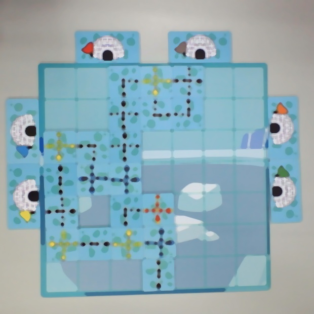
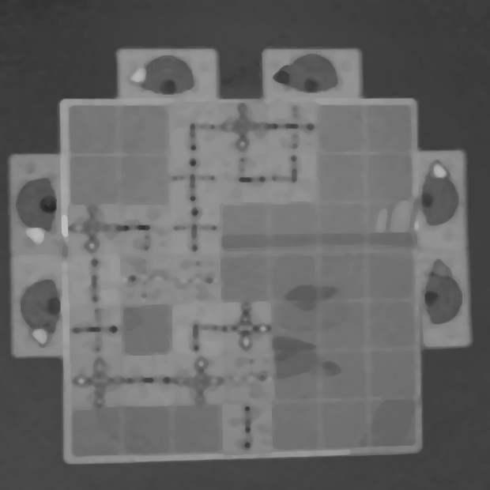
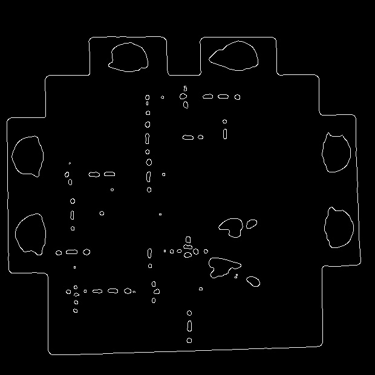
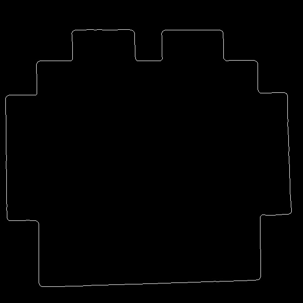

# BoardGameImgPyCv2 for Gogokids 程式邏輯思維桌遊

本專案為提供Gogokids桌遊的辨識結果，所寫出來的工具
共有兩個版本
1. Gogokids unity版本 - 可在IOS跟Android平台執行
2. 開發版本 - 為unity版本提供可行性的影像處理方案，開發語言為python 使用 OpenCV

而本專案為開發版本，目的是為了針對特定案例進行探索並找出可行性方案
以便未來在unity版本中作使用
# 邏輯概述

目前採用錄影中每N個畫面當作輸入，並進行棋盤偵測

  

當偵測到棋盤格時，進行辨識路徑邏輯

  

根據每一種路徑進行相似度計算，轉換為最終結果

  

## 棋盤偵測
我們需要根據輸入的畫面找到棋盤的確切位置

  

先將畫面擷取出感興趣的區域(Region of Interest, ROI)，我們使用簡單的CropImage處理
在使用者介面方面，劃出範圍並提示使用者棋盤要在所預定的框框內

  

這個做法有以下幾個優點 
  1. 可以減少運算量 
  2. 可以減少畫面中其他物件的干擾，並提高棋盤偵測的準確率 
 
在進行影像辨識前先上一層高斯模糊，可以增加偵測的準確度

  

影像轉換 
1. RGB轉HSV 
2. HSV轉灰階 
3. 使用MedianFilter做平滑化處理 

  
  
  

### 進行Canny Edge(邊界計算)

  

### 從所有邊界中找出最大邊界

  

### 邊角偵測運算，找尋邊界中所有可能的角點

  

### 透過區塊MinMax找出，棋盤端點

  

### 映射轉換

  

最後輸出結果圖，以便在棋盤辨識時使用

## 路徑辨識

我們將路徑辨識根據難度分成下列幾個步驟

1.空白路徑偵測 
2.紅色路徑偵測 
3.綠色路徑偵測 
4.藍色路徑偵測 
5.黑色路徑偵測 -> 進一步辨識方向
### 空白路徑
我們需要將空白的路徑偵測出來並排除掉，這樣就可以避免偵測不準確的問題。

白色偵測結果

  

白色為偵測到為空白的區域。

### 紅色路徑偵測

紅色偵測結果

  

### 綠色路徑偵測

  

### 藍色路徑偵測

  

藍色是所有路經中最難偵測的，所以我們的threshold會調低一點
也就是寬鬆一點。

### 黑色路徑偵測

  

黑色路徑圖會進一步確認他屬於那一種路經。
首先，我們會切成7x7的方格並取得其中一個方格。
在方格中我們會分成上、左、下、右來進行分數計算，如果辨識分數超過一定threshold則判定有路徑，最後再根據上、左、下、右是否有路徑的順序得到最終的路徑結果。

# 環境

python 3.10.7
